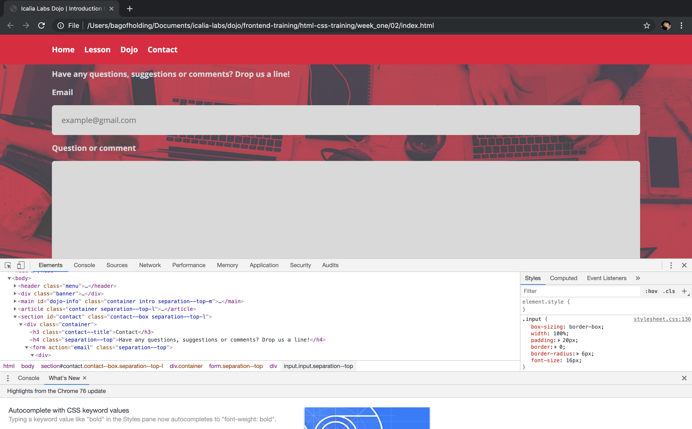
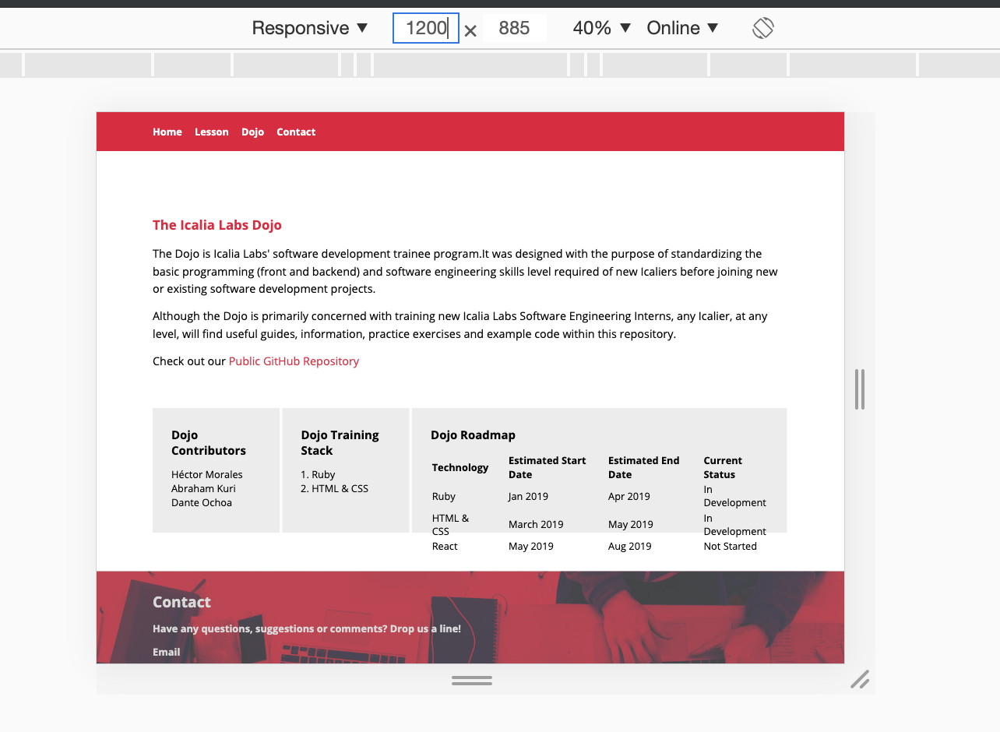
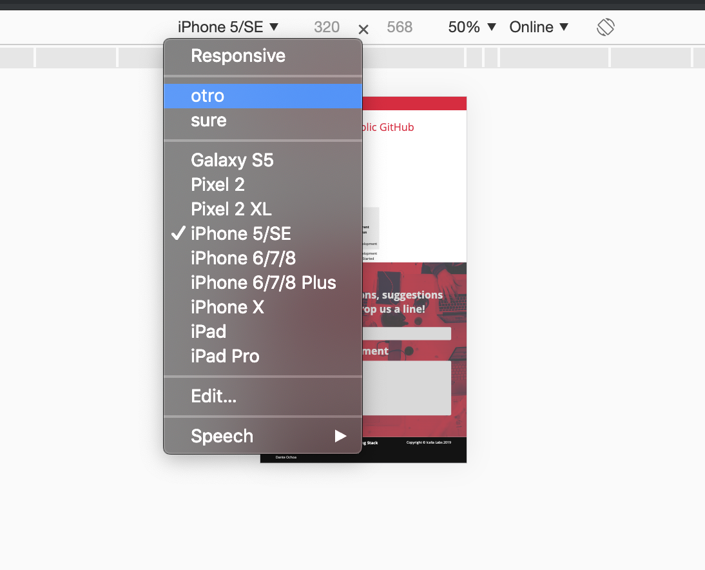

DAY 4 - MEDIAS QUERIES & RESPONSIVE

## Lesson Objectives

After this stage the trainee should be able to:

+ Understand how the browser inspector works for responsive view.
+ Learn how to use flex to make elements responsive.
+ Learn the use of media query technique.
+ Understand grid-view system that most CSS toolkits have.

 ## Lesson

This lesson will focus on making a web page responsive, this means that the page will transform depending on the width of the screen, window or device.

+ Learn the use the inspector mode of the browser.
+ Media query: `@media`, `screen`, `and`
+ `min-width`, `max-width`, `min-height`, `max-height`
+ `flex-wrap`

To see if a markup it’s responsive you can move width and height of the window and see how it responds to smaller size window.

To see if the markup will work on a mobile devices you can use the inspect option on the browser, there will be a Responsive Design Mode with a cellphone icon.

The first thing that it’s important to see is the inputs for the px ratio, where you can change to see how the page looks on different pixel sizes.

There is also the option to check different devices with height and widths predefined for popular devices like different versions of apple and android devices, with extra option of creating your own template.

## Practice

Each trainee will practice the previously covered theory by writing CSS code according to the following instructions/requirements:

### Web Developer Portfolio

In this exercise, you will continue to create your own web developer portfolio by making sure that the page has a mobile layout.

*For this exercise, only the structure is mandatory. Copy (content text) placeholders (Lorem Ipsum for text, placehold.it for images) may be used.*

1. All the points that were requested the past two days.

2. Make a responsive design for the website and a mobile design.

3. You must use the following CSS properties:
  1. Media query
  2. `Flex-wrap`
  3. Change rules for different views: `height`, `width`, `font-size`

## Self Study

## Code academy: Learn Responsive Design Lesson 1 and 2
https://www.codecademy.com/learn/learn-responsive-design/modules/learn-responsive-design-module

## Responsive Web Design Principles: Introduction to the Responsive Web Design Challenge
https://learn.freecodecamp.org/responsive-web-design/responsive-web-design-principles

## Useful links

https://www.w3schools.com/Css/css_rwd_mediaqueries.asp
https://css-tricks.com/css-media-queries/