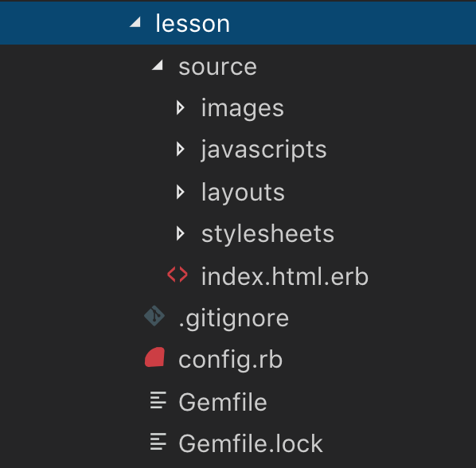

DAY 5 - SASS

## Lesson Objectives

After this stage the trainee should be able to:

+ Learn how to install sass using middleman. 
+ Learn what SASS (Syntactically Awesome Style Sheet)  is.
+ Learn how to use the nesting feature of sass.
+ Understand sass basic functions and mixins.

 ## Lesson

This lesson consists of a detailed exploration of the SASS syntax and installation.

+ Explain and demo:
  + middleman
  + nesting rules
  + `@import`, `partial sass file`, `variables`

  Middleman is a static web generator that uses Ruby as base and when you initialize a project with middleman sass it's already whitin the middleman gem.

  To install middleman you can follow the instructions on the webstie.
  https://middlemanapp.com/basics/install/

  After you isntall middleman you can check out how your folder will look like this

  

  If you are a designer the source folder it's the folder that will havee all the relevant sub folders to do the static website.

  The [layout.erb](lesson/source/layouts/layout.erb) it's where the head body tag it's defined.

  The [index.htm.erb](lesson/source/index.html.erb) it's were you can start writing the markup.

  There will be a folder called stylesheets with [site.css.scss](lesson/source/stylesheets/site.css.scss) it's were you can add your css style. In this file we will start to se the changes of the sass syntax.

  The [lesson.html](lesson/lesson.html) and [lesson/stylesheet.css](lesson/assets/stylesheet.css) files in this directory contains commented code examples for all of these concepts. These files can also be opened in the browser to demonstrate the effects of the HTML markup and the CSS style.

## Practice

Each trainee will practice the previously covered theory by writing CSS code according to the following instructions/requirements:

### Web Developer Portfolio

In this exercise, you will continue to create your own web developer portfolio by making sure that the page has a mobile layout.

*For this exercise, only the structure is mandatory. Copy (content text) placeholders (Lorem Ipsum for text, placehold.it for images) may be used.*

1. All the points that were requested the past four days.

2. Install middleman in your Web Developer Portfolio folder.

3. Convert all your code to SASS using at least :
  1. partial files.
  2. Imports.
  3. Variables.
  4. Nesting.

Check out the [practice/](practice/) subdirectory in this directory, which you can use to continue building your static portfolio.

## Self Study

## Code Academy: Learn Sass

+ **Section 1 - Create a SASS stylesheet**
https://www.codecademy.com/learn/learn-sass/modules/learn-sass-hello-sass-u

+ **Section 2 - Mixins and Selectors**

https://www.codecademy.com/learn/learn-sass/modules/learn-sass-mixins-and-parent-selector-u

+ **Section 3 - Functions and Operators**

https://www.codecademy.com/learn/learn-sass/modules/learn-sass-functions-and-operations-u

## Useful Links

+ **SASS documentation**
https://sass-lang.com/guide
