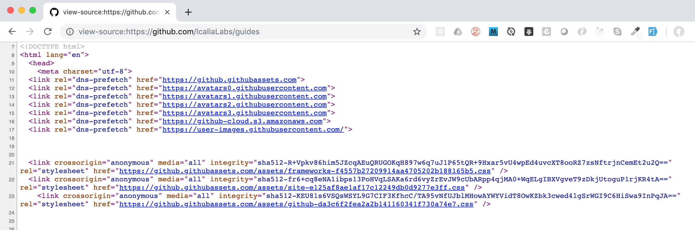
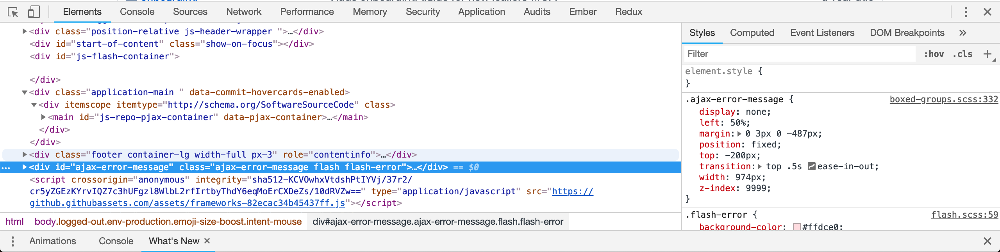

# Dojo HTML & CSS Training Plan - Week One

## Week Overview

This directory contains a full week's worth of lessons, practice exercises and relevant resources that cover **Week One**'s training syllabus. Each numbered subdirectory contains resources (files, documents and relevant links) for the respective training day (starting at 01).

## Objective

The main objective for the first week of training is for the trainee to become proficient in their use of markup (esp. HTML) and styling (esp. CSS) languages for basic web development.

By the end of the week, the trainee should be able to create static web pages that are well structured and adequately styled, following both global as well as Icalia Labs' internal standards and conventions.

## Table of contents

* [00 - Tools and Information](#tools-and-information)
* [01 - Introduction to HTML](01)

## Tools and Information

### Web Browsers

One of the most important basic aspects of frontend web development is the environment. In general, both markup and styles live in our web browsers, making browsers the closest thing to an environment static web pages have.

At Icalia Labs, we emphasize the importance of making sure our markup and styles look and behave properly in at least the following browsers:

* Google Chrome
* Mozilla Firefox
* Safari

[This website](https://caniuse.com/) can be used to check whether a new web (HTML or CSS) feature has been adopted by each of the listed browsers.

### Web Developer Tools

When it comes to writing markup and styles, some of the most useful tools for web designers and developers are the browsers' web development tools. These tools vary from browser to browser, but in general, they allow us to see the markup from which the websites we visit are rendered, as well as the cascading-stylesheet (css) rules that are responsible for styling them. 

These tools allow us to both learn from other people's/organization's work as well as test and improve our own markup and styles. The following is a list and introduction to the web developer tools in each of the above mentioned browsers.

### Chrome Developer Tools

***The following tools are practically the same for any [Chromium](https://www.chromium.org/)-based browser.***

* **View Page Source:**
  
  * *How to access:* Right-click on website body -> View Page Source
  * *Use:* Opens a new tab with the raw HTML markup from which the website is rendered.
* **Inspect Element:**
  
  * *How to access:* Right click on website element -> Inspect
  * *Use:* Opens Chrome Dev Tools window, including:
    * HTML Markup Viewer (left):
      * Scrollable and clickable markup viewer
    * CSS Inspector (right):
      * Scrollable and editable style viewer
      * CSS Classes and properties are listed and shown in descending order of precedence
      * Changes can be seen live in browser
    * Responsive Mobile Mode (top-left mobile device icon):
      * Switches viewing mode to responsive or mobile device mode
      * Allows developers to preview their websites on mobile device dimensions and viewports

For more information on the Chrome Developer Tools, please check out [this page](https://developers.google.com/web/tools/chrome-devtools/).

If you want to know more about how we write markup and styles at Icalia, check out our [guides](https://github.com/IcaliaLabs/guides/tree/master/stack/ruby).
